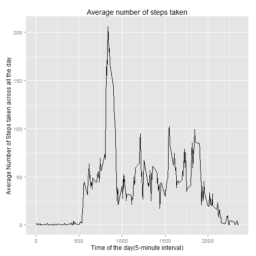
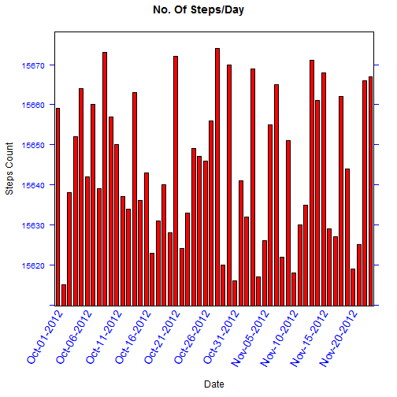
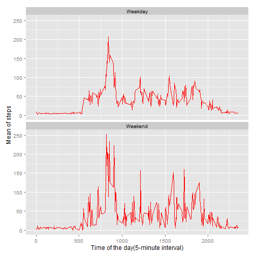

### Loading Packages

```r
library(lattice)
library(ggplot2)
```

```
## Warning: package 'ggplot2' was built under R version 3.2.1
```

```r
library(httr)
```

```
## Warning: package 'httr' was built under R version 3.2.1
```

```r
library(Hmisc)
```

```
## Warning: package 'Hmisc' was built under R version 3.2.2
```

```
## Loading required package: grid
## Loading required package: survival
## Loading required package: Formula
```

```
## Warning: package 'Formula' was built under R version 3.2.2
```

```
## 
## Attaching package: 'Hmisc'
## 
## The following objects are masked from 'package:base':
## 
##     format.pval, round.POSIXt, trunc.POSIXt, units
```


###Loading and preprocessing the data
####1.Load the data using read.csv


```r
##Getting full dataset : Please note that activity.csv is present in the present Working directory

activity_data_set <- read.csv('activity.csv')


#Remove the NA values , cleaning the data for our use and pre-processing it for analysis , finally aggregating it based on dates.
data_by_day <- setNames(aggregate(steps~as.Date(date), activity_data_set, sum, na.rm = TRUE), c("date","steps"))
```


####2.Processing the data for analysis

```r
#The horizontal axis sequencing based on an interval of 10 days.
x_axis <- seq(1, nrow(data_by_day), by = 10)

#Determining/Defining the X-Axis label layout properties 

scale_factor <- list(x = list(rot = 60, cex = 1.2, labels = format(data_by_day$date, "%b-%d-%Y")[x_axis], at = x_axis) , col = 'blue' )
```


###What is mean total number of steps taken per day? (ignoring missing values)

####1. Make a histogram of the total number of steps taken each day

```r
#Finally , plot a barchart using the below function based on the above obtained parameters  and Logical flag Horizontal as default.

barchart(date ~ steps, data = data_by_day, main = "No. Of Steps/Day",  xlab = "Date", ylab = "Steps Count", scales = scale_factor , col ='red' , horizontal = FALSE)
```

![plot of chunk ]](figure/]-1.png) 

####2. Calculate and report the mean and median total number of steps taken per day

- Mean

```r
paste("Mean:", mean(data_by_day$steps))
```

```
## [1] "Mean: 10766.1886792453"
```

- Median

```r
paste("Median:", median(data_by_day$steps))
```

```
## [1] "Median: 10765"
```


###What is the average daily activity pattern?


```r
time_series_data <- aggregate(x=list(mean_of_steps = activity_data_set$steps), by = list(interval= activity_data_set$interval), FUN=mean, na.rm=TRUE)
```
####1. Make a time series plot

```r
ggplot(data = time_series_data, aes(x = interval, y = mean_of_steps)) + geom_line() + xlab(expression(paste('Time of the day' , '(5-minute interval)'))) +
    ylab(expression(paste('Average Number of Steps taken across all the day'))) + ggtitle( "Average number of steps taken" )
```

 


####2. Which 5-minute interval, on average across all the days in the dataset, contains the maximum number of steps?


```r
# which.max gives the record number which contains the maximum number.
max_steps_pos <- which.max(time_series_data$mean_of_steps)

#then identify the record which has maximum no. of steps at a given interval 

max_steps <- time_series_data$max_steps_pos

#Print the result of the above

paste( 'Maximum no. of steps :' , max_steps$mean_of_steps , 'at' , max_steps$interval , 'interval')     
```

```
## [1] "Maximum no. of steps :  at  interval"
```


###Inputing missing values

####1. Calculate and report the total number of missing values in the dataset (i.e. the total number of rows with NAs)

```r
paste("Number of missing values:", sum(is.na(activity_data_set$steps)))
```

```
## [1] "Number of missing values: 2304"
```
####2. Devise a strategy for filling in all of the missing values in the dataset.
- Replace the Missing observations with the sample mean instead of replacing them by zero (the sample won't bias the estimates while the zero will result in a bias result)

####3. Create a new dataset that is equal to the original dataset but with the missing data filled in.

```r
activity_data_set_filled <- activity_data_set
#Using impute function to fill in the missing values with the mean value of the steps
activity_data_set_filled$steps <- impute(activity_data_set_filled$steps, fun=mean)  
```

####4. Make a histogram of the total number of steps taken each day

```r
#Remove the NA values  if any from the filled up data set and aggregating it 
data_by_day_filled <- setNames(aggregate(steps~as.Date(date), activity_data_set_filled, sum, na.rm = TRUE), c("date","steps"))


#The horizontal axis sequencing based on an interval of 5 days.
x_axis_filled <- seq(1, nrow(data_by_day_filled), by = 5)

#Determining/Defining the X-Axis label layout properties 

scale_factor_filled <- list(x = list(rot = 60, cex = 1.2, labels = format(data_by_day_filled$date, "%b-%d-%Y")[x_axis_filled], at = x_axis_filled) , col = 'blue' )


#Finally , plot a barchart using the below function based on the above obtained parameters  and Logical flag Horizontal as default.

barchart(date ~ steps, data = data_by_day_filled, main = "No. Of Steps/Day",  xlab = "Date", ylab = "Steps Count", scales = scale_factor_filled , col ='red' , 
horizontal = FALSE)
```

 


#####Mean of data after missing data is filled  

```r
paste("Mean:", mean(data_by_day_filled$steps))
```

```
## [1] "Mean: 10766.1886792453"
```
#####Median of data after missing data is filled  

```r
paste("Median:", median(data_by_day_filled$steps))
```

```
## [1] "Median: 10766.1886792453"
```

####Estimating the difference b/w means after imputing the NA values  

```r
paste("Means difference:", mean(data_by_day_filled$steps) - mean(data_by_day_filled$steps))
```

```
## [1] "Means difference: 0"
```
####Estimating the difference b/w medians after imputing the NA values  

```r
paste("Medians difference:", mean(data_by_day_filled$steps) - mean(data_by_day_filled$steps))
```

```
## [1] "Medians difference: 0"
```

###Are there differences in activity patterns between weekdays and weekends?


####1. Create a new factor variable in the dataset with two levels - "weekday" and "weekend" indicating whether a given date is a weekday or weekend day.

```r
#creating anew variable named dateType
activity_data_set_filled$Type_date <-  ifelse(as.POSIXlt(data_by_day_filled$date)$wday %in% c(0,6), 'Weekend', 'Weekday')
```
####2. Make a panel plot containing a time series plot

```r
average_filled_data <- aggregate(steps ~ interval + Type_date , data = activity_data_set_filled , mean)
ggplot(average_filled_data, aes(interval, steps)) + 
    geom_line(col = 'red') + 
    facet_wrap(~ Type_date, ncol=1) +
    xlab(expression(paste('Time of the day' , '(5-minute interval)'))) + 
    ylab(expression(paste('Mean of steps')))
```

 

 
                          


